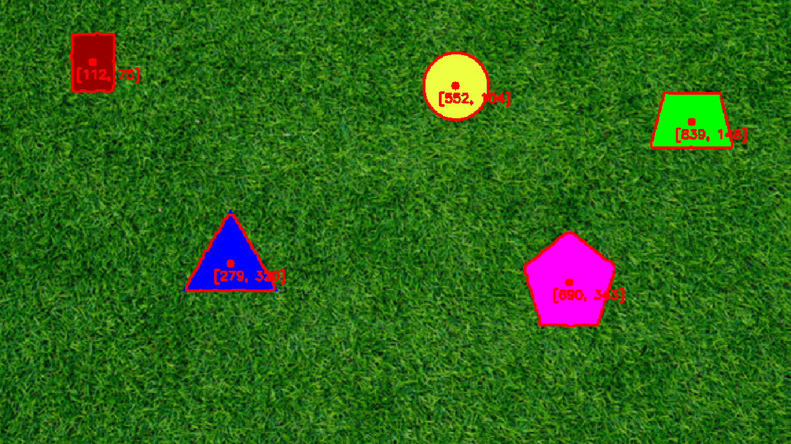
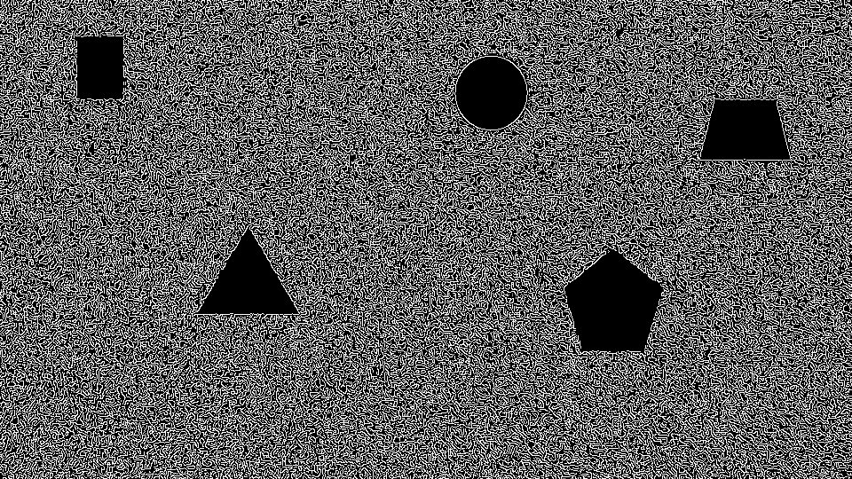
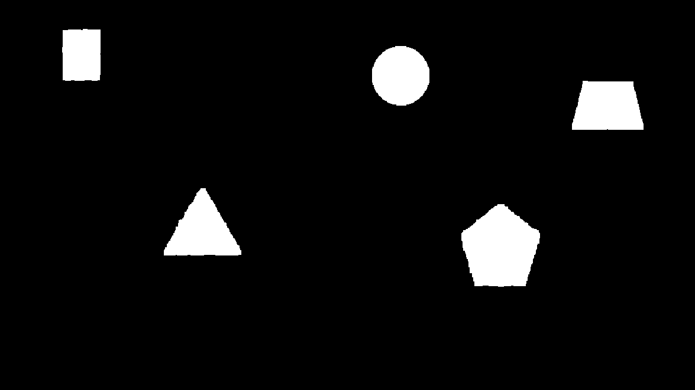
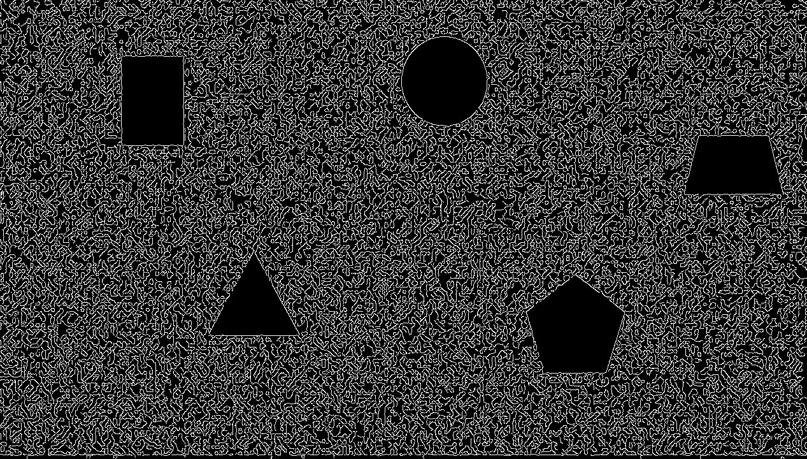
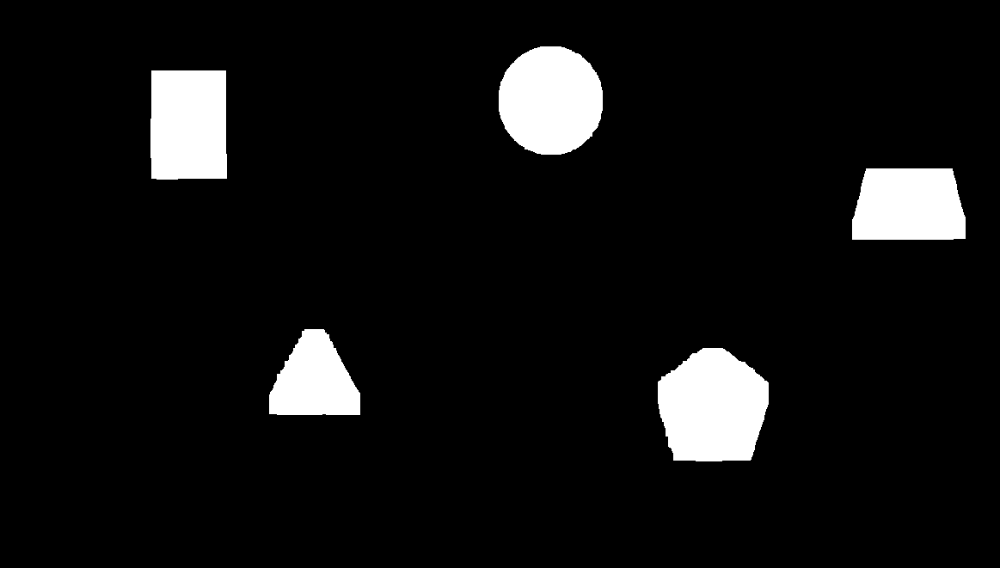

# PennAiR 2025 Application ✈️

## Installation / Setup

1. Have ROS 2 installed. The distro I used for development was Jazzy Jalisco on Ubuntu 24 (WSL). Install here: https://docs.ros.org/en/jazzy/Installation.html
Clone the repository
```bash
    git clone https://github.com/yuzhiliu8/pennair-application.git
    cd pennair-application
```
2. Download python dependencies
```python
    pip install -r requirements.txt
    # OR 
    pip install opencv-python numpy
```

3. Edit the video_path configuration file:
```yaml
pennair-application/src/system_configuration/config/video_publisher_params.yaml


video_path: /path/to/your/video
```

3. Build and Run
```bash
    # source ros environment (binaries)
    source /opt/ros/jazzy/setup.bash # .zsh, depending on which terminal you are using

    #OR, if installed from source:
    source /path/to/ros_workspace/install/local_setup.bash

    #Build packages
    colcon build --symlink-install

    #Source pennair packages
    source install/setup.bash

    #run!
    ros2 launch shape_edge_detector shape_edge_detector.launch.py
```

## Documentation
My project is split up into 3 ROS packages:
```python
    - shape_edge_detector   
    - system_configuration
    - video_publisher
```
 - `shape_edge_detector` - Subscribes to the ROS topic, performs the edge detection algorithm, and displays the result live. This package also contains `shape_edge_detector.launch.py`, which is the entry point for the entire application
 - `system_configuration` - Contains the system configuration files for video_publisher and shape_edge_detector. Allows you to tweak params such as the streaming video path, and dilation/erosion, and canny thresholds

 - `video_publisher` - Streams the video from the path specified in the config file to a ROS topic

## Process

### Static Image:

My initial approach to solve part 1 was to use HSV filtering. I realized that the colors contrasted a lot in the static image, and the shapes could easily be extracted from the background if I filtered out the correct HSV values. 

Here is what I did:

1. Convert image from BGR to HSV
2. use `cv.inRange()` function with multiple lower/upper HSV bound pairs to create masks of the shapes
3. Perform bitwise-or operations on the image arrays to combine all shapes into one mask
4. use `cv.findContours()` to find edges on the mask, also performing necessary steps to find the center of each contour

Result:


### Background Agnostic:

The same HSV bounds wouldn't work for different videos/background colors, so I decided to find a less hard-coded method.

1. Grayscale the image
2. Run canny edge detection (static img): 
3. Ran a MORPH_CLOSE (dilation $\rightarrow$ erosion) to connect the white edges and then did a bitwise_not to create a mask (static img): 

Dynamic Hard Canny Result: 
Dynamic Hard reversed closed mask: 

Result:


### Depth Calculation:

I used these simple pinhole camera equations to calculate the depth:

$x = f_x \frac{X}{Z}$, $y = f_y \frac{Y}{Z}$

$x$: pixels
$X$: real world (inches)
$Z$: real world (inches)

$Z = f_x \frac{X}{x}$, $Z = f_y \frac{Y}{y}$

I calculated the pixel radius of the circle from `cv.minEnclosingCircle()` and got the inch to pixel ratio.

Since $f_x$ and $f_y$ were different, I plugged in the values into both of the equations and averaged them, getting $Z = ~245.41$ inches

To calculate $X$ and $Y$, I isolated them from in the above equations, since I know $x$, $y$, $f_x$, $f_y$, and $Z$

## Next Steps

This algorithm relies on the fact that the background has a lot of intensity changes, so it can dilate and reverse the canny detection to create a good mask. It might not work as well if the background's intensity changes were more spread out, or if it was a solid background. I could add another layer to check if the intensity changes are close together

I could also try some micro adjustments in the algorithm, such as performing a bitwise not first, and then trying a morph_open


